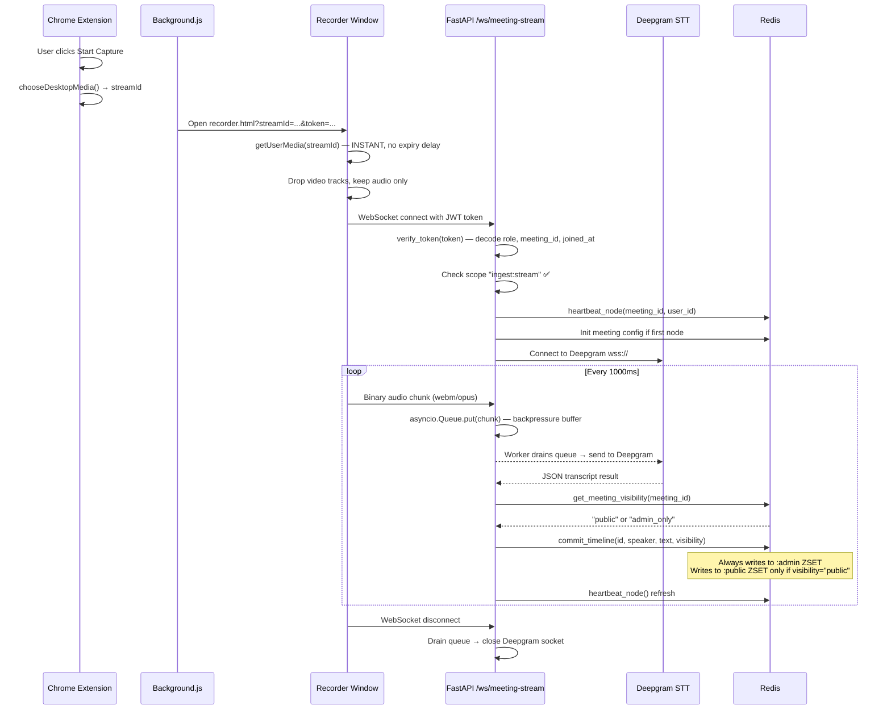
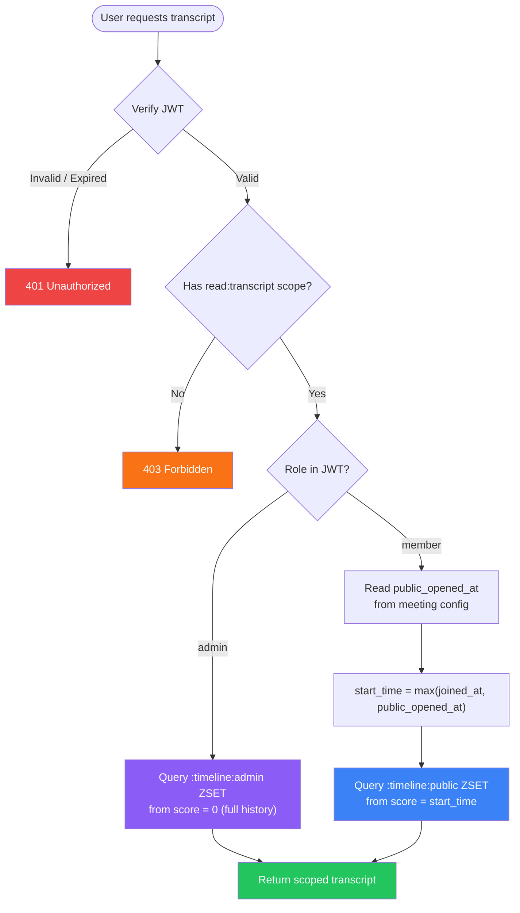
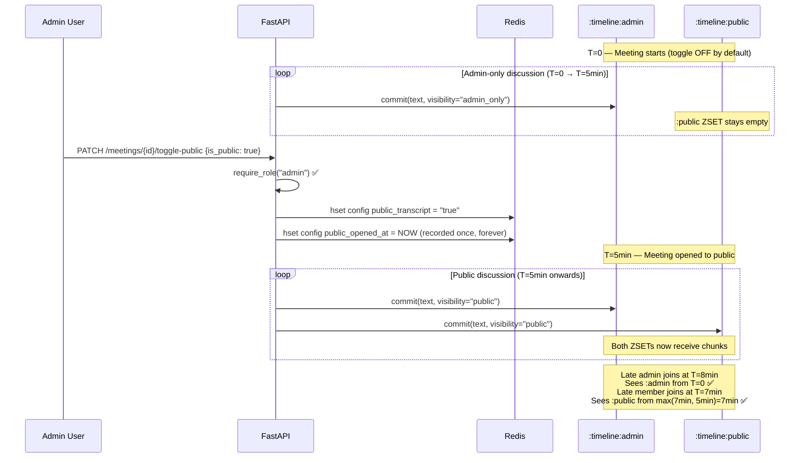
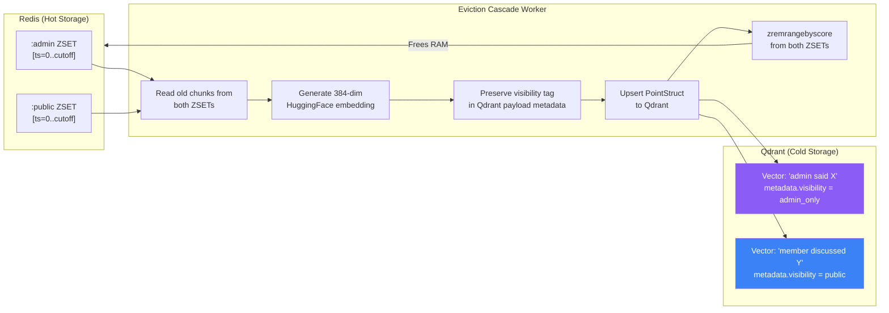
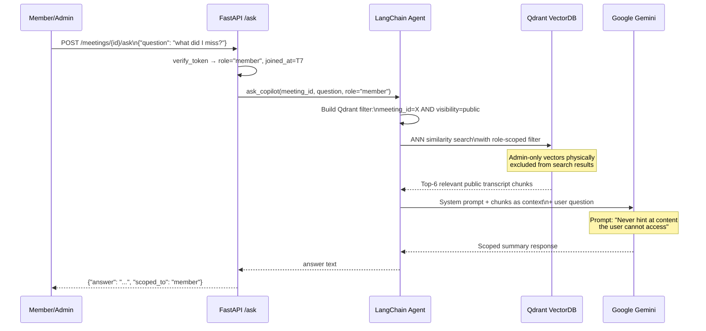
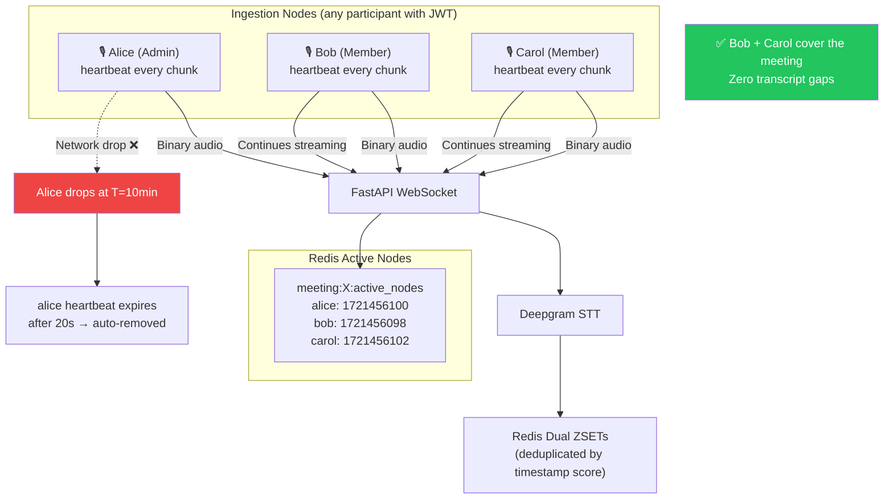
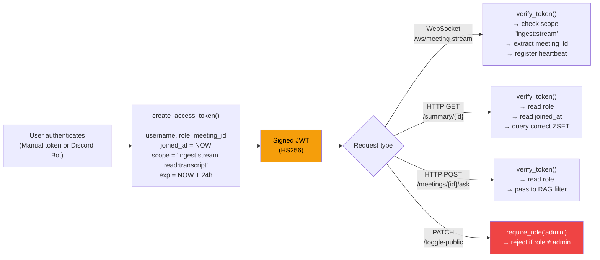

# 🗺️ Catch-Me-Up: Complete System Flow

> All diagrams below are Mermaid. Open this file in any Mermaid-compatible viewer (GitHub, VSCode Markdown Preview, etc.)

---

## 1. Audio Ingestion Flow
*How audio gets from a participant's desktop into the dual Redis ZSETs*

---

## 2. Access Control: Who Reads What
*How the dual ZSET model enforces role-based access*

---

## 3. Meeting Visibility Toggle
*How an admin controls what members can see, in real-time*

---

## 4. Eviction Cascade → Visibility-Aware Qdrant
*How old Redis data is migrated to Qdrant without losing access control*

---

## 5. "Catch Me Up" RAG Pipeline
*How the AI generates a scoped summary without leaking admin content*

---

## 6. Active Node Redundancy
*How multiple ingestion nodes provide fault-tolerance*

---

## 7. JWT Lifecycle
*From authentication to access control enforcement*

