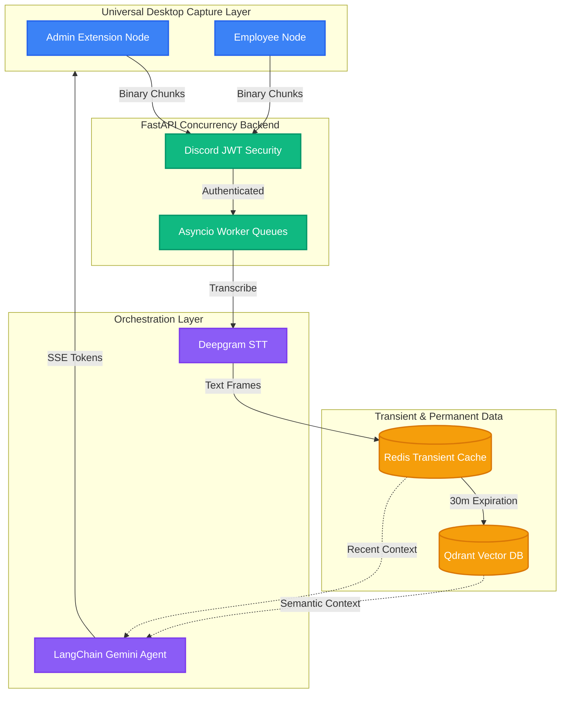

# 🎙️ Catch-Me-Up: Real-Time AI Meeting Copilot

A bot-free, enterprise-grade architecture designed to capture live audio from native desktop applications (Discord, Zoom, Google Meet), handle high-throughput transcription pipelines, and deliver real-time, role-secured contextual catch-ups using Vector RAG and Gemini AI.

👉 **[Start Here: The Learning Curriculum & Roadmap](learn/ROADMAP.md)**

---

## 🏗️ Core Architecture Overview

---

## 🛠️ Deep-Dive System Features

### 1. Universal Desktop Audio Interception (Chunk 7)
Avoids heavy, intrusive third-party headless server bots. Instead of being trapped in the browser sandbox, the client leverages `chrome.desktopCapture` to hook directly into the system audio output of native desktop applications (like the Discord App). It pipes raw systemic audio buffers directly to our WebSocket array.

### 2. Backpressure Mitigation & Asyncio (Chunks 1 & 2)
Constant 100ms binary streaming creates severe network backpressure that will block Python's single-threaded event loop. Sockets behave strictly as producers, dropping raw buffers into a thread-safe `asyncio.Queue` (Memory Bucket). Independent background tasks consume from this bucket at their own pace, preventing Out-Of-Memory server crashes.

### 3. Redis Transient Consensus & Deduplication (Chunk 3)
Writing raw high-frequency streams directly to a Postgres SQL cluster bottlenecks I/O operations. Instead, we use a **Redis Sorted Set (ZSET)**. Timelines are saved purely in RAM. If multiple users in the same meeting upload the exact same transcript at the exact same millisecond, Redis inherently ignores the duplicate by matching the Unix timestamp scores.

### 4. Vector Eviction Cascades (Chunk 4)
RAM is incredibly fast but expensive and limited. To prevent Redis from running out of memory during a 5-hour meeting, a background cron worker performs "Eviction Cascades". It sweeps up older transcripts, converts them into 1,536-dimensional math coordinates (Vectors), and dumps them permanently into **Qdrant Vector Database**, freeing up Redis RAM.

### 5. LangChain Agent Orchestration (Chunk 5)
When a user asks the Copilot for the MOM (Minutes of Meeting) or what happened during a missed duration, we don't send the entire 5-hour meeting to Gemini (which would break token limits). Instead, the Agent performs **Retrieval-Augmented Generation (RAG)** using **LangChain**. It searches Qdrant for the specific chronological paragraphs mathematically closest to the user's question, and sends *only* those paragraphs to Gemini.

### 6. Discord-Driven JWT RBAC Security (Chunk 6)
Checking a SQL database to see if a session cookie is valid on every single WebSocket request is too slow. The architecture uses stateless **JSON Web Tokens (JWT)**. Furthermore, to drop user administration overhead, we tie identity directly to Discord Roles. If Discord says you are a "Moderator", we bake an `ingest:stream` scope directly into the cryptographic JWT payload, allowing you to bypass database lookups entirely.

---
👉 **[View the Learning Curriculum & Roadmap](learn/ROADMAP.md)**
