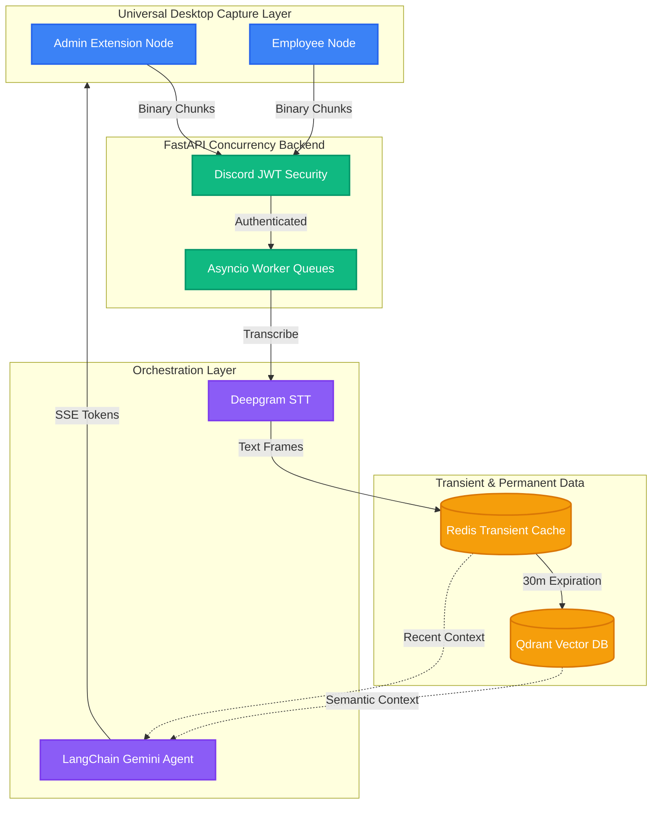

# 🎙️ Catch-Me-Up: Real-Time AI Meeting Copilot

<div align="center">


**A bot-free, enterprise-grade architecture for live desktop audio capture, high-throughput transcription pipelines, and real-time contextual AI catch-ups.**

[Curriculum & Roadmap](learn/ROADMAP.md) • [Report Bug](#) • [Request Feature](#)

</div>

---

## 📖 Table of Contents
- [About the Project](#-about-the-project)
- [Core Architecture](#-core-architecture-overview)
- [System Features](#-deep-dive-system-features)
- [Getting Started](#-getting-started)
  - [Prerequisites](#prerequisites)
  - [Installation](#installation)
- [Environment Variables](#%EF%B8%8F-environment-variables)
- [Security Model](#-security-model)

---

## 🚀 About the Project

**Catch-Me-Up** is an advanced AI Meeting Copilot that securely hooks into native desktop applications (like Discord, Zoom, and Google Meet) to provide real-time transcriptions and summaries. 

Unlike traditional meeting bots that require headless servers and intrusive joins, this architecture intercepts native audio streams client-side and processes them through an incredibly fast, highly concurrent FastAPI/Redis backend, augmented with LangChain and Google's Gemini models for semantic retrieval.

---

## 🏗️ Core Architecture Overview



---

## 🛠️ Deep-Dive System Features

### 1. Universal Desktop Audio Interception
Avoids heavy, intrusive third-party headless server bots. Using `chrome.desktopCapture` and **Manifest V3 Offscreen Documents**, the client securely hooks directly into the system audio output of native desktop apps and pipes raw binary buffers directly to our WebSocket array, completely bypassing background service worker sandbox limitations.

### 2. Backpressure Mitigation & Asyncio
Constant 100ms binary streaming creates severe network backpressure that blocks Python's single-threaded event loop. We treat WebSockets as strict producers dropping buffers into thread-safe `asyncio.Queue` (Memory Buckets). Background workers consume these at their own pace to prevent Out-Of-Memory crashes.

### 3. Redis Transient Consensus & Deduplication
Writing high-frequency streams to a Postgres SQL cluster bottlenecks I/O operations. Instead, timelines are saved purely in RAM via **Redis Sorted Sets (ZSET)**. If multiple users in the same meeting upload identical transcripts simultaneously, Redis inherently drops the duplicates by matching Unix timestamp scores.

### 4. Vector Eviction Cascades
To prevent Redis from running out of memory during long meetings, a background cron worker performs "Eviction Cascades". It sweeps older transcripts, converts them into 1,536-dimensional coordinate vectors, and permanently dumps them into **Qdrant Vector DB**, freeing up Redis RAM.

### 5. LangChain Agent Orchestration
When asking the Copilot for the Minutes of Meeting (MOM), we don't send the entire 5-hour meeting to Gemini (breaking token limits). The Agent performs **Retrieval-Augmented Generation (RAG)** using **LangChain**. It searches Qdrant for chronological paragraphs mathematically closest to the question, and sends *only* those to Gemini.

---

## 🏁 Getting Started

### Prerequisites

You need the following installed on your machine:
* [Docker Desktop](https://www.docker.com/products/docker-desktop/)
* [Python 3.12+](https://www.python.org/downloads/) (for local dev)
* A valid Deepgram API Key (for Speech-to-Text)
* A valid Google AI Studio (Gemini) API Key

### Installation

1. **Clone the repository:**
   ```bash
   git clone https://github.com/your-org/catch-me-up.git
   cd catch-me-up
   ```

2. **Setup your environment variables:**
   ```bash
   cp .env.example .env
   ```
   Open `.env` and fill in your API keys.

3. **Start the robust infrastructure stack:**
   ```bash
   docker-compose up --build
   ```
   *This single command spins up FastAPI, the Redis transient store, and the Qdrant Vector database.*

4. **Verify it's running:**
   Navigate to `http://localhost:8000/docs` to see the interactive Swagger UI.

5. **Load the Chrome Extension:**
   - Open Chrome and navigate to `chrome://extensions/`
   - Enable **Developer mode** in the top right.
   - Click **Load unpacked** and select the `extension/` folder in this repository.
   - Click the new extension icon in your toolbar, input your JWT, and click Start Capture!

---

## ⚙️ Environment Variables

To run this project, you will need to add the following environment variables to your `.env` file:

| Variable | Description | Example |
| :--- | :--- | :--- |
| `GOOGLE_API_KEY` | Your Google AI Studio Key for Gemini 1.5 Flash | `AIzaSyB...` |
| `DEEPGRAM_API_KEY` | Deepgram API key for high-speed STT models | `a1b2c3d...` |

---

## 🔒 Security Model

### Discord-Driven JWT RBAC Security
Checking a SQL database for session validity on every high-frequency WebSocket request is far too slow. This architecture uses stateless **JSON Web Tokens (JWT)**. 

To eliminate user administration overhead, identity is tied directly to Discord Roles using OAuth2. If Discord confirms a user is a "Moderator", we bake an `ingest:stream` scope directly into the cryptographic JWT payload, allowing them to bypass database lookups entirely while maintaining strict access controls.

---

<div align="center">
  Built with ❤️ for real-time collaboration.
  <br />
  <br />
  <a href="learn/ROADMAP.md"><b>Explore the Learning Curriculum 👉</b></a>
</div>
